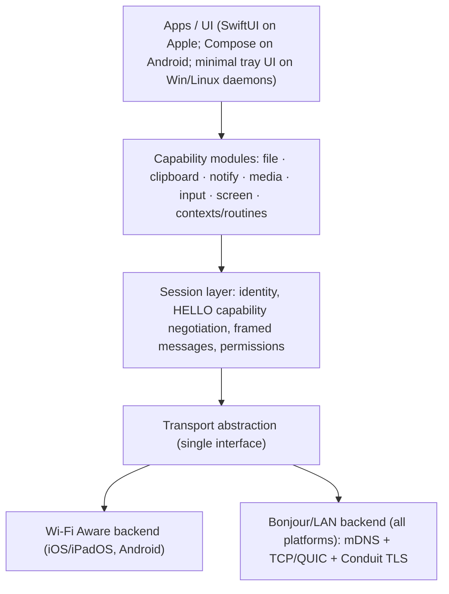

# Conduit — Technical Specification and Full Build Plan

**Open, local-first, cross-device connectivity.**
Spec version 0.2 (draft). Supersedes v0.1.

Heritage: this project modernizes **mosis** (APPture, 2011-2012), a mobile OS integrated solution covering display sharing, connection management, device peripherals, location profiles, and an assistant that automated routines. This document audits that vision against 2026 platform reality, keeps everything that survives, states plainly what does not, and lays out an implementation plan detailed enough to hand individual phases to AI coding agents.

> **Naming: decided 2026-07-17 — the product is MOSIS** (ADR 0014). "Conduit" was the working codename and survives in identifiers on purpose: the `conduit-*-v1` crypto domain strings and the `_cndt-*` service types are compatibility boundaries frozen into the golden vectors and the paired fleet, so they change only as one deliberate clean break (`docs/plans/01-rename-to-mosis.md`). Read "Conduit" below as the codename, not an open question.

---

## 1. Summary

Conduit is a local-first connectivity layer that lets a person's devices (phone, tablet, laptop, desktop, TV) discover each other, pair once, and then exchange files, clipboard contents, notifications, media control, input, and screen content over a fast peer-to-peer link. No cloud, no account, no relay. Where the OS allows it, devices talk directly with no router in the path (Wi-Fi Aware). Everywhere else, they talk over the shared local network (Bonjour/mDNS + TCP/QUIC). The wire protocol is open and documented so independent clients can interoperate.

The 2011 mosis vision was roughly five years early on transport (Wi-Fi Direct was never reliable enough) and fifteen years early on the assistant. In 2026 the transport problem is solved by Wi-Fi Aware on both mobile platforms, the desktop-mode half of the vision has been absorbed into Android itself, and the assistant half has moved from science fiction into on-device AI territory. What remains unbuildable is a short, specific list of walls, all on iOS, all documented below so no phase wastes time on them.

---

## 2. Feasibility audit: the 2011 vision against 2026 reality

Each pillar from the original mosis/APPture document, with a verdict and where it lands in the plan.

| # | 2011 pillar | 2026 verdict | Where it lands |
|---|---|---|---|
| 1 | Desktop-mode launcher | **Absorbed by the OS.** Android 16 QPR3 shipped native desktop windowing + connected displays (GA on Pixel 8+ and recent Samsung, built with Samsung on the DeX foundation). iOS/iPadOS launcher replacement is impossible. | Dropped as a product. Conduit integrates *with* desktop mode (adaptive UI, external-display awareness) rather than providing it. |
| 2 | Display sharing (mobile-focused RDP) | **Buildable app-to-app in every useful direction.** Every platform can be a screen *source* except tvOS; every platform can be a *viewer* inside the Conduit app. The only wall: nothing can become a system-level receiver on iOS (AirPlay stays Apple's), and nothing can mirror *into* other apps on iOS. | Phase 3 (Apple), Phase 5 (Android), Phase 4 (desktops). |
| 3 | Connection manager / automated device detection | **This is the product.** Unified discovery, pairing, capability negotiation, status. Bluetooth management is right-sized: accessory pairing UX yes, universal BT stack no (iOS is BLE-only; no Classic HID host without MFi). | Phase 1 onward. Core. |
| 4 | Location-based profiles (work/home/transit, state saving) | **Buildable with consent.** Geofencing (Core Location regions, Android geofencing), dock/power triggers, per-profile capability defaults. iOS state-saving across apps is limited to what Shortcuts/App Intents allow; Android allows more. | Phase 7 (Contexts). |
| 5 | Social sharing (permissioned streams to other people) | **Buildable locally.** Multi-viewer sessions with view-only vs control permissions over the same P2P/LAN transports. Internet-range sharing (the Discord/Twitch analogy) requires a relay and is out of core scope; an optional self-hosted relay is noted as future work, never a dependency. | Phase 7. |
| 6 | Peer-to-peer ad hoc (the Wi-Fi Direct dream) | **Solved by Wi-Fi Aware, with one honest asterisk.** iOS 26 ships the Wi-Fi Aware framework (iPhone/iPad only); Android has had Aware since 8.0. Same-platform Aware works today. iPhone-to-Android Aware is the intended endgame (EU mandates Aware 4.0 now, 5.0 later) but real-world pairing between the two currently breaks at the encrypted stage on many Android devices; Apple DTS calls compliant Android hw/sw combos rare. Treat cross-OS Aware as a gated probe with LAN fallback always on. | Phases 0, 1, 5. |
| 7 | Display extension (extra monitors) | **Partially buildable, platform-split.** Windows: yes, documented Indirect Display Driver (IddCx) model, a Conduit virtual monitor extending INTO a tablet/phone viewer is legitimate. Linux: yes (evdi/DRM). macOS: creating a virtual display relies on private API (the BetterDisplay/Duet-style approach); flagged as an optional unsupported module, never core. iOS/iPadOS: viewer role only (and Apple's Sidecar already owns iPad-as-Mac-display; do not fight it, offer app-window streaming instead). | Phase 6. |
| 8 | Mouse/keyboard: devices as wireless peripherals | **Buildable in the directions that matter, plus one big 2026 upgrade.** Any device can send input to a desktop receiver (macOS CGEvent, Windows SendInput, Linux portal/libei, and Android can even *receive* via AccessibilityService). The wall: nothing can inject system input into iOS. The upgrade: **Android can be a genuine Bluetooth HID peripheral** (BluetoothHidDevice, API 28+), meaning a phone literally becomes a real BT keyboard/trackpad to ANY host including an iPad or smart TV, no software needed on the host. iOS cannot take the HID peripheral role. | Phase 2 (phone→Mac), Phase 5 (Android HID + receiver). |
| 9 | Virtual assistant / routine automation | **From sci-fi to your day job.** On-device models (Apple's Foundation Models framework, already used in Sclr) can power a suggestion engine over context signals (location, dock state, time, connected peers). Actions execute through user-approved automations: Conduit profiles, App Intents/Shortcuts on iOS, richer hooks on Android, and Matter for smart-home scenes. The wall that remains: autonomous cross-app puppeteering on iOS (the 2011 burger-ordering scenario) is still not possible; everything is suggest-then-confirm or a pre-authorized automation. | Phase 7 (Routines). |

**Net verdict:** of nine pillars, one is obsolete because the platforms shipped it (a win, not a loss), seven are buildable with direction-specific scoping, and the assistant pillar is buildable in a consent-first form that is more credible in 2026 than the original autonomous version ever was.

---

## 3. Transport decision: Wi-Fi Aware, and where Matter actually fits

**Wi-Fi Aware is the transport. Matter is not a transport and never will be one in this system.**

- **Wi-Fi Aware (NAN)** carries data: files, screen frames, input events, clipboard. It is an open Wi-Fi Alliance standard, works without any router or internet, is authenticated and encrypted at the Wi-Fi layer on Apple's implementation, and coexists with the device's normal Wi-Fi connection. iOS/iPadOS 26+ (framework, entitlement-gated, iPhone/iPad only). Android 8.0+ (hardware-dependent, check `FEATURE_WIFI_AWARE`). macOS/Windows/tvOS: no practical public Aware API; those platforms ride the LAN backend.
- **Matter** is a smart-home *control plane*: a standard way to command lights, locks, thermostats, blinds, scenes. In Conduit it appears exactly once, inside the Phase 7 Routine engine, as an *action type* ("profile 'Home Office' activated → set desk lamp scene via Matter"). Conduit can act as a Matter controller through the platform SDKs (Apple's Matter framework + MatterSupport extension on iOS; Google Home / Matter SDKs on Android; CHIP tool libraries on desktop). Matter Casting (sending content to Matter-capable TVs) exists but adoption is thin (mainly Fire TV); the TV strategy is native Conduit viewer apps instead, with Matter Casting revisited only if adoption grows.

Rule for all agents building this: **if a task involves moving bytes between devices, it is Aware/LAN. If a task involves telling a home device to change state, it is Matter, and only inside Routines.**

---

## 4. Platform capability matrix (2026)

Legend: ✓ supported via public API. ✗ not possible. ⚠ possible only via private/gray API (optional module, never core). ◐ partial/conditional.

| Capability | iOS/iPadOS | macOS | Windows | Linux | Android | tvOS / Android TV |
|---|---|---|---|---|---|---|
| Wi-Fi Aware transport | ✓ 26+, entitlement, device-list gated | ✗ | ✗ | ◐ experimental (chipset/wpa_supplicant) — treat as ✗ | ✓ 8.0+, hw-dependent | ✗ |
| Bonjour/LAN transport | ✓ | ✓ | ✓ | ✓ | ✓ (NSD) | ✓ |
| Screen source | ✓ ReplayKit broadcast ext | ✓ ScreenCaptureKit (window OR display) | ✓ Windows.Graphics.Capture / DXGI | ✓ PipeWire + ScreenCast portal | ✓ MediaProjection | ✗ |
| Screen viewer (in-app) | ✓ | ✓ | ✓ | ✓ | ✓ | ✓ (this is the TV story) |
| System input receiver (inject) | ✗ | ✓ CGEvent (Accessibility TCC) | ✓ SendInput | ✓ RemoteDesktop portal + libei (Wayland), XTest (X11), uinput (root) | ✓ AccessibilityService.dispatchGesture (consent) | ✗ |
| Notification source | ✗ (no API to read other apps) | ✗ (no public API) | ✓ UserNotificationListener (consent) | ✓ D-Bus org.freedesktop.Notifications | ✓ NotificationListenerService (consent) | ✗ |
| Notification display | ✓ | ✓ | ✓ | ✓ | ✓ | ✓ |
| Clipboard: ambient/background sync | ✗ (paste prompts; foreground only) | ✓ | ✓ | ✓ | ✗ (10+ blocks background read) | n/a |
| Clipboard: explicit send/receive action | ✓ (share ext, in-app action) | ✓ | ✓ | ✓ | ✓ (share sheet, in-app) | ◐ receive only |
| BT HID peripheral role (be a real keyboard/mouse) | ✗ | ✗ | ✗ | ◐ BlueZ, niche | ✓ BluetoothHidDevice API 28+ | ✗ |
| Virtual display creation (be an extra monitor host) | ✗ | ⚠ private CGVirtualDisplay-style | ✓ IddCx driver | ✓ evdi / DRM leases | ✗ | ✗ |
| Matter controller (Routines only) | ✓ Matter framework | ◐ verify current framework availability | ◐ via CHIP libs | ◐ via CHIP libs | ✓ Home/Matter SDK | ✓ (Apple TV/Google TV are hubs) |

Design consequences baked into every phase:
1. Every feature must state its **direction** (source→sink) before implementation; the matrix, not optimism, decides feasibility.
2. The LAN backend is universal and always on; Aware is an accelerator, never a dependency.
3. Anything marked ⚠ lives in an `unsupported/` module behind a build flag, excluded from App Store builds.

---

## 5. Architecture

### 5.1 Layers



### 5.2 Identity and reconnection

A peer is a stable **device identity** created at pairing (keypair + human name + device class), never an IP address. Sessions resume across address changes and across backend switches (a pair that met over Aware can reconnect over LAN and vice versa). Identity store is local, per device, exportable for backup.

### 5.3 Transport abstraction

One protocol-facing interface, two backends:

```swift
protocol TransportBackend {
    func advertise(service: ServiceDescriptor) async throws
    func browse(service: ServiceDescriptor) -> AsyncStream<DiscoveredEndpoint>
    func connect(to endpoint: DiscoveredEndpoint) async throws -> ByteStreamConnection
    func listen() -> AsyncStream<ByteStreamConnection>
}
```

- **AwareBackend (Apple):** discovery/pairing via `DeviceDiscoveryUI` (`DevicePairingView` on the publisher, `DevicePicker` on the subscriber); connections via the Network framework. Runtime gate: `WACapabilities.supportedFeatures.contains(.wifiAware)`. Link security (key exchange + encryption) is handled by the system.
- **AwareBackend (Android):** `WifiAwareManager` publish/subscribe + network specifier data path. Gate on `PackageManager.FEATURE_WIFI_AWARE`.
- **LANBackend (all):** `NetworkListener`/`NetworkBrowser`/`NetworkConnection` on Apple (NetworkBrowser handles both Bonjour and Aware discovery, which keeps discovery code unified); NSD on Android; mDNS libs (zeroconf) in the Go core for Windows/Linux. Conduit supplies its own encryption here (section 7).

Service naming (applies to Aware services): unique, letters/digits/dashes, **15 characters max**, TCP or UDP; register the chosen names with IANA to avoid collisions. Reserve now: `_cndt-app._tcp` (app-to-app) and `_cndt-scrn._udp` (screen/media), adjusting to fit the 15-char limit after final naming. **As built, only `_cndt-app._tcp` is ever advertised** — screen frames ride a dedicated TCP/TLS bulk connection invited in-band by `SCREEN_ATTACH`, and the one UDP/DTLS datagram lane (coalesced `INPUT_EVENT` moves) is invited by `INPUT_STATUS`, so neither needs its own advertised service. ADR 0016 retires the separate UDP service entirely. Register one name, not two.

### 5.4 Session layer

TLV (length-prefixed) framing over the byte stream; Apple's recommended stack for own-app-to-own-app is Coder over TLS or QUIC, which the Network framework provides directly. First exchange is always `HELLO`/`HELLO_ACK` capability negotiation; no capability may be used before it appears in `HELLO_ACK`. This negotiation is the original "smart connecting" idea made concrete: a TV viewer advertises {screen-view, media-target}; a phone advertises nearly everything; the session uses only the intersection.

---

## 6. Wire protocol v0.2

Serialization: JSON control messages during Phases 0-3 (debuggable while unstable), raw binary side-channel for bulk data (file chunks, screen frames). Phase 4 publishes a protobuf schema and freezes v1. Every message carries: `version`, `type`, `session_id`, `seq`.

| Type | Direction | Payload sketch | Phase |
|---|---|---|---|
| HELLO / HELLO_ACK | both | identity, name, device class, version, pubkey, capabilities[], platform walls[] | 1 |
| PING / PONG | both | nonce, t | 1 |
| CLIPBOARD_PUSH | sender→receiver | mime, data (explicit action; ambient only desktop↔desktop) | 1 |
| FILE_OFFER / ACCEPT / REJECT | as named | file id, name, size, mime, sha256 | 1 |
| FILE_CHUNK / FILE_ACK | sender↔receiver | id, seq, bytes / id, seq or complete | 1 |
| MEDIA_CONTROL | controller→target | play, pause, next, prev, seek, vol | 2 |
| INPUT_EVENT | sender→receiver | kind (move, click, scroll, key, gesture), payload, modifiers | 2 |
| NOTIFICATION | source→display | app, title, body, icon?, actions? | 4-5 |
| SCREEN_OFFER / SCREEN_ACCEPT | source↔viewer | session, codec (hevc/h264), resolution, fps, capture kind (display or window) | 3 |
| SCREEN_FRAME / SCREEN_END | source→viewer | session, seq, keyframe?, data | 3 |
| PERMISSION_REQUEST / GRANT / REVOKE | both | capability, scope (view-only vs control), peer, ttl | 7 |
| DEVICE_STATE | both | battery, charging, docked, foreground, display attached | 7 |
| ROUTINE_* | reserved | reserved for Phase 7 sync of profiles | 7 |

Versioning rule (invariant): the envelope never changes shape; unknown `type` is ignored with a logged warning; capabilities are feature-flagged strings so old peers and new peers always interoperate at the intersection.

---

## 7. Security model

- **Pairing = one-time trust.** Aware path: system pairing (PIN flow) establishes trust and the system encrypts the link thereafter. LAN path: Conduit pairing exchanges and pins peer public keys (trust on first use), verified out-of-band by a short emoji/word fingerprint shown on both screens.
- **Encryption.** Aware links: system-provided. LAN links: mandatory Conduit TLS keyed to pinned identities. Plaintext on the LAN path is forbidden in all builds, including debug (invariant).
- **Post-quantum option.** The LAN handshake is a seam where the PQRC/EldrChat primitives can slot in later; design the handshake behind a `KeyAgreement` interface so classical X25519 today can become hybrid later without protocol surgery. Decision deferred to the crypto design doc (open decision #2).
- **Permissions.** Input and screen control are the dangerous capabilities. Defaults: screen-view requires per-session accept on the source; input-control requires per-session accept on the receiver plus a persistent on-screen indicator while active; multi-viewer adds per-peer grants (Phase 7).
- **Threat model (initial).** Adversary on the same LAN attempting discovery abuse, impersonation, or interception. Pinned identities + mandatory encryption + explicit permission gates address it. Full crypto design is a follow-on document before Phase 4 publication.

---

## 8. UI/UX: the mosis design language, modernized

Mapping the 2012 mockups onto the 2026 apps, because the original interaction ideas hold up:

| mosis element (2012) | Conduit translation (2026) |
|---|---|
| Chat-heads-style floating device bubbles | Peer bubbles: each discovered/paired device is a draggable avatar chip showing class icon, name, live status ring (discovered / paired / connected / streaming). SwiftUI on Apple; Compose on Android. |
| **Connect** vs **Share** buttons per device | Keep this verb pair verbatim; it encodes direction perfectly. Connect = pull (their screen/content to me). Share = push (mine to them). Every capability inherits the pair: Share file, Connect to screen, Share input… |
| "Streaming Min-PC (1366x768), FPS 30, Connection Strength, Connection Time" panel | Session stats overlay, toggleable: resolution, fps, codec, throughput, RTT, backend badge (AWARE or LAN). Doubles as the debug HUD in development builds. |
| Toggle Frame Buffer / Toggle Screen Capture | Capture-kind toggle mapped to ScreenCaptureKit's real modes: **entire display** vs **single app window** (macOS source), and quality/latency preset toggle. |
| APP-Launcher vs Android-OS toggle | On modern Android sources: stream the whole display vs a single app's MediaProjection scope; on Mac: display vs window. Same mental model the 2012 UI wanted. |
| mosis Pro numbered dock slots (1-4) around the canvas | Multi-peer session tray: up to N connected peers docked around the active viewer, tap to swap the focused stream, long-press for the Connect/Share pair. Direct ancestor of the Phase 7 multi-viewer UI. |
| Devices / Profile / Settings nav | Devices (peer list + pairing), Contexts (Phase 7 profiles, hidden until then), Settings. |

Design language: keep it warm and instrument-panel-like rather than sterile; the stats overlay is a feature, not shame. Detailed visual design deferred to a design pass after Phase 1 works.

---

## 9. Build plan: Phases 0-7 with implementation steps

Conventions for every phase: work happens on a feature branch per step group; every step lists its acceptance test; a phase is done only when all acceptance criteria pass on real hardware; anything discovered impossible gets written into section 4's matrix and the phase notes rather than worked around silently.

---

### Phase 0 — Validation spikes (1-2 weeks, throwaway code allowed)

**Goal:** prove the three transport legs on real hardware before any architecture hardens.

**Prereqs:** Apple Developer account; request the `com.apple.developer.wifi-aware` entitlement immediately (lead time risk); confirm the iPhone and iPad in hand appear on Apple's supported-device list for the Wi-Fi Aware framework (documentation link in §13; reporting on the exact model cutoff varies, so verify against Apple's list directly, not press coverage); one Android 13+ device with `FEATURE_WIFI_AWARE` for the interop probe (borrow/cheap used Pixel is fine).

**Steps:**
1. **LAN probe (the MVP's actual dependency).** New iOS app target + new macOS app target in one Xcode project. iOS: `NetworkListener` publishing Bonjour service `_cndt-app._tcp` with `NSLocalNetworkUsageDescription` and `NSBonjourServices` set in Info.plist. macOS: `NetworkBrowser` for that service, `NetworkConnection` on selection, exchange a JSON hello both directions, then push a 100 MB file with naive chunking.
   *Accept:* file transfers both directions; note observed MB/s; local-network permission prompt appears exactly once.
2. **Aware probe, same-platform.** Apple's Wi-Fi Aware sample app pattern: publisher side `DevicePairingView(.wifiAware(.connecting(to:from:)))`, subscriber side `DevicePicker`, then a Network framework connection over the paired endpoint. iPhone ↔ iPad.
   *Accept:* pairing PIN flow completes; hello exchanged; reconnection works after both apps relaunch without re-pairing.
3. **Aware probe, cross-OS (gated, expected flaky).** Android side: minimal Kotlin app with `WifiAwareManager` publish + subscribe using the same service name. Attempt discovery both directions against the iOS sample. Record exactly where it fails (discovery vs pairing vs data path). Do not debug beyond a day; the goal is a written status snapshot, not a fix. Known state going in: community reports show discovery can succeed while Apple's pairing stage fails against many Android devices.
   *Accept:* a one-page written result: works / fails-at-X, device models, OS versions. This gates Phase 5's Aware ambitions.
4. Write `docs/spike-results.md` with throughput numbers, prompts encountered, and the interop snapshot.

**Pitfalls:** forgetting `NSBonjourServices` (browser silently finds nothing); testing Aware on unsupported hardware (check `WACapabilities.supportedFeatures` first and print it); assuming the Android device supports Aware because it's recent (it's OEM-dependent).

---

### Phase 1 — Apple MVP: transport core + file + clipboard (3-6 weeks)

**Goal:** a daily-drivable iOS + macOS pair moving files and clipboard, on the real architecture.

**Steps:**
1. **Repo + package scaffold** per §10. Create `ConduitKit` (Swift Package) with targets: `ConduitTransport`, `ConduitSession`, `ConduitProtocol`, `ConduitCapabilities`. Apps depend on the package; no logic in app targets beyond UI.
2. **Protocol module.** Implement envelope + the Phase 1 message set from §6 as `Codable` types; TLV framing helpers; golden test vectors written to `proto/vectors/*.json` (these become the cross-language conformance suite; invariant: vectors are append-only).
3. **LANBackend.** `NetworkListener` + `NetworkBrowser` + `NetworkConnection` behind `TransportBackend`. Include Bonjour TXT record with identity fingerprint so the browse UI can label known peers before connecting.
4. **Identity + pairing (LAN).** Ed25519 identity keypair in Keychain; pairing ceremony: 6-digit confirm code + word-pair fingerprint rendered on both devices; store pinned peer records (SwiftData or flat file, keep it boring).
5. **Conduit TLS on LAN.** TLS 1.3 via Network framework security options with the pinned peer key as the verification anchor; refuse downgrade; unit test that an unpinned peer is rejected.
6. **Session layer.** Connection state machine (idle → connecting → hello → ready → degraded → closed); HELLO capability negotiation; reconnect-with-backoff keyed to identity, not address.
7. **File capability.** Offer/accept UX both platforms; chunked transfer with hash verification and resume-from-last-acked-chunk; background-friendly on iOS (finish small transfers with `beginBackgroundTask`, surface "keep app open" for large ones honestly rather than pretending).
8. **Clipboard capability.** Desktop→desktop future-proofing but for this phase: macOS menu-bar "Send clipboard to iPhone" (ambient watching allowed on Mac), iOS explicit "Send clipboard" button + a Share-sheet extension ("Send to Mac"); incoming clipboard on iOS sets `UIPasteboard` and posts a local notification. **Do not attempt ambient clipboard on iOS; the OS forbids background reads and will paste-prompt.**
9. **AwareBackend (Apple), thin slice.** Wire the Phase 0 probe into `TransportBackend` so iPhone↔iPad file transfer rides Aware when both sides support it; LAN remains the fallback path chosen automatically when Aware is unavailable. Feature-flag if entitlement approval hasn't landed.
10. **Minimal UI** per §8: peer bubbles, Connect/Share pair, transfer progress, stats overlay behind a debug flag.

**Acceptance criteria:** pair iPhone↔Mac in under 60 seconds cold; transfer a 1 GB file with hash verified and resume surviving an airplane-mode blip; clipboard round trip via explicit actions; unpinned/mitm peer rejected (test with a second Mac); Aware path used automatically for iPhone↔iPad when available (verified via stats overlay backend badge).

**Pitfalls:** iOS local-network prompt appears at first browse, design onboarding around it; App Review needs a clear purpose string; QUIC vs TLS-over-TCP choice can be deferred (interface hides it), start TCP+TLS for simplicity; don't let file chunks share the control channel's head-of-line (separate stream or connection for bulk).

---

### Phase 2 — Remote layer: phone as trackpad/keyboard/remote for the Mac (2-4 weeks)

**Goal:** the useful direction of the input pillar, shipped.

**Steps:**
1. **INPUT_EVENT + MEDIA_CONTROL protocol** additions with coalescing (batch move events at 120 Hz max, send deltas).
2. **macOS injector.** `CGEvent` posting for pointer move/click/scroll/drag and key events; requires Accessibility permission (TCC): build the guided-permission flow (open System Settings pane, poll `AXIsProcessTrusted`). Media keys via HID system-defined key events (play/pause/next). Persistent menu-bar indicator + one-keystroke kill switch (invariant: input control always visibly indicated and instantly revocable on the receiver).
3. **iOS controller UI.** Trackpad surface (pan → move, tap → click, two-finger → scroll/right-click), keyboard mode (UIKit key capture including modifiers), media remote strip, haptics on click.
4. **Latency work.** Target motion-to-photon under 50 ms on LAN: UDP-style low-latency path (QUIC datagrams or a parallel UDP channel) for move events while clicks/keys stay reliable-ordered.
5. **Permission gate.** Receiver-side per-session consent dialog before any injection; auto-expire grants.

**Acceptance:** control the Mac's cursor smoothly enough to use daily (subjective bar: you stop reaching for the physical trackpad for couch use); zero stuck-modifier bugs across app switches; kill switch works mid-drag; media keys control whatever app has system Now Playing.

**Pitfalls:** CGEvent coordinates are global display space, handle multi-monitor origins; secure-input fields (password boxes) block synthetic keys, detect `IsSecureEventInputEnabled` and tell the user instead of failing silently; don't send absolute coordinates from the phone, send deltas.

> **Amended 2026-07-26 (ADR 0015).** The delta rule stands for a *trackpad* — a
> surface whose operator cannot see the remote cursor has nothing to be absolute
> about, and inventing coordinates there is the mistake this pitfall names. It
> does not stand for a controller **watching a live view** of the screen it is
> driving, which is what Phase 3 step 5 composes. That surface may additionally
> send `nx`/`ny` normalized to the captured source, plus the
> `screen_session_id` that says which source, so a click lands where the person
> pointed. Deltas ride along with every such event, so a receiver that ignores
> the position still tracks the pointer.

*(Note: v0.1 placed notification display here; removed because in an Apple-only pair no platform can legally source notifications: iOS and macOS both lack the API. Notifications arrive with the first source-capable platforms in Phases 4-5.)*

---

### Phase 3 — Screen experiences (3-5 weeks)

**Goal:** Mac→iPhone/iPad viewing (window or display), and iPhone→Mac screen-out.

**Steps:**
1. **SCREEN_* protocol** with codec negotiation; bulk frames on a dedicated stream.
2. **macOS source.** ScreenCaptureKit capture of a chosen display OR single window (the mosis toggle); VideoToolbox `VTCompressionSession` HEVC with low-latency rate control enabled, H.264 fallback; keyframe on viewer join; adaptive bitrate from ack feedback.
3. **Apple viewer.** VideoToolbox decode → Metal/CALayer render; stats overlay (fps, bitrate, RTT, backend); tap-to-fullscreen; picture-in-picture on iPad.
4. **iOS source.** ReplayKit **broadcast upload extension** feeding encoded frames to the pipe. Constraint: extensions are memory-capped (~50 MB) and sandboxed; run the encoder inside the extension, ship frames out via the network directly from the extension process; the container app shows session state. System-wide capture requires the user to start it from the broadcast picker; in-app-only capture can skip the extension.
5. **Combine with Phase 2:** viewing a Mac screen on iPad + touch mapped to INPUT_EVENT = the 2011 "mobile remote desktop" complete, in the direction the platforms allow.

**Acceptance:** 1080p Mac window streamed to iPad at ≥30 fps with end-to-end latency under ~120 ms on LAN; iPhone screen visible on the Mac via broadcast picker start; codec renegotiation on the fly when moving between Aware and LAN mid-session is not required (session may drop and resume; resuming must be one tap).

**Pitfalls:** broadcast extension memory limit kills naive implementations, encode early, never buffer raw frames; ScreenCaptureKit needs Screen Recording TCC permission with its own guided flow; HDR/wide-color mismatch between capture and encode produces washed-out output, pin BT.709 for v1.

---

### Phase 4 — Open protocol + portable core + Windows/Linux daemons (4-8 weeks)

**Goal:** the protocol becomes a published spec with a second, non-Swift implementation, and the desktop matrix fills in. Notifications light up for real.

**Steps:**
1. **Freeze protocol v1.** Convert control messages to a protobuf schema in `proto/`; keep the JSON debug mode behind a flag; regenerate golden vectors in both encodings; publish `docs/protocol.md` (message reference, handshake, security requirements, service names).
2. **Go core (`conduit-core`).** Implements: identity, pairing, LAN discovery (mDNS lib), TLS with pinning, session layer, file + clipboard + input-send + notification-source capabilities. Passes the conformance vectors (CI job runs Swift and Go against the same vectors; invariant: a release requires both green).
3. **Windows daemon + tray app.** Go core + small tray UI. Input inject: `SendInput`. Notification source: WinRT `UserNotificationListener` (user consent flow). Screen source: `Windows.Graphics.Capture` (can land in 4b if time-boxed).
4. **Linux daemon.** Go core + CLI/tray. Input inject: `xdg-desktop-portal` RemoteDesktop + libei on Wayland, XTest fallback on X11 (document the split clearly; do not require root/uinput for the default path). Notification source: D-Bus. Screen source: PipeWire via the ScreenCast portal.
5. **Notifications capability** end-to-end: Windows/Linux sources → iPhone/Mac displays, with per-app filtering on the source and quick actions where the source exposes them.
6. **Publish.** Protocol doc + Go core released under the chosen license (open decision #5); announce as a spec others can implement, in the LocalSend/KDE-Connect tradition, with the honest differentiator stated: iOS as a first-class peer including Aware.

**Acceptance:** Go daemon on a Linux box pairs with the iPhone over LAN, receives a file, injects input from the phone, and mirrors its notifications to the phone; conformance CI green in Swift + Go; a third party could implement a client from `docs/protocol.md` alone (test: give it to a coding agent with no other context and see how far it gets).

**Pitfalls:** Wayland vs X11 input is the classic trap, abstract it behind one Go interface from day one; Windows notification listener requires the app identity/packaging to be right (MSIX or sparse package), budget time for packaging, not code.

---

### Phase 5 — Android as a first-class peer (4-8 weeks)

**Goal:** the cross-platform promise, with the honest Aware gate.

**Steps:**
1. **Client strategy decision executed:** Kotlin app implementing protocol v1 natively (preferred: real Android citizen, conformance vectors keep it honest), with the Go core via gomobile held as fallback if duplication hurts.
2. **LAN parity first.** NSD discovery, TLS pinning, file + clipboard(explicit) + input-send + media-control; pairs with all existing peers. Ship this before touching Aware.
3. **Aware backend (Android↔Android).** `WifiAwareManager` publish/subscribe + data path; same service names.
4. **Aware interop attempt (Android↔iPhone), gated by the Phase 0 snapshot.** Re-test on current OS versions across 2-3 Android models; if pairing still fails at the encrypted stage, ship with LAN-only cross-OS and a documented status page; re-probe each OS cycle (the EU's Aware 5.0 requirement means this will keep moving).
5. **Android superpowers.** Screen source via MediaProjection; input **receiver** via AccessibilityService `dispatchGesture` (consent + persistent notification, mirroring the macOS indicator invariant); notification source via NotificationListenerService with per-app filters.
6. **BT HID peripheral mode (headline feature).** `BluetoothHidDevice` profile: the phone registers as a real Bluetooth keyboard+trackpad combo usable by ANY host, including an iPad or a smart TV, with zero Conduit software on the host. UI: the Phase 2 trackpad/keyboard surface gains a mode switch: "Conduit peer" (our protocol) vs "Bluetooth HID" (any host). This is the purest realization of the 2011 peripherals pillar.
7. **Desktop-mode citizenship.** Adaptive layouts so Conduit behaves in Android 16 desktop windows/connected displays; peer bubbles and viewer windows resize sanely.

**Acceptance:** Android↔iPhone file transfer over LAN; Android↔Android over Aware; Android controls the Mac; Mac views the Android screen; phone-as-BT-keyboard types into an iPad with Conduit not installed on the iPad; written interop status page for Android↔iPhone Aware with device/OS specifics.

**Pitfalls:** AccessibilityService will trigger Play Store review scrutiny, write the declaration honestly and gate the capability off by default; MediaProjection requires the system consent dialog every session by design, don't fight it; Aware on Android is OEM-flavored, keep a tested-devices table in docs.

---

### Phase 6 — TV viewers + display extension (3-6 weeks)

**Goal:** the smartTV pillar and the extra-monitor pillar, scoped to the legal directions.

**Steps:**
1. **tvOS viewer app.** LAN backend + screen viewer + media-target + notification display; pairing via on-TV code. (No Aware on tvOS.)
2. **Android TV / Google TV viewer.** Same capability set via the Kotlin client; sideload-friendly plus Play (TV) listing.
3. **Windows virtual display.** IddCx indirect display driver creating a "Conduit Display"; frames captured from the virtual surface → screen pipeline → any Conduit viewer (tablet becomes a genuine extra Windows monitor). Signed-driver logistics are the real work; budget it.
4. **Linux virtual display.** evdi (or headless output + DRM lease) equivalent.
5. **macOS virtual display: `unsupported/` module only.** Private-API approach documented, off in App Store builds, honest README about why. Core macOS offering stays window/display *streaming* (Phase 3), and iPad-as-Mac-monitor is conceded to Sidecar.
6. Optional convenience senders (nice-to-have, cut first): AirPlay-out and Google Cast-out of a Conduit viewer for hotel-TV scenarios; Matter Casting only if ecosystem adoption has grown by then.

**Acceptance:** Apple TV shows a Mac window stream controlled from the phone; a cheap Android tablet functions as a second Windows monitor over LAN with usable latency for docs/terminal work (target under ~80 ms).

---

### Phase 7 — Contexts, Routines, Matter, multi-viewer (4-8 weeks, and the fun one)

**Goal:** the 2011 assistant pillar rebuilt on consent: profiles that notice context and offer to act.

**Steps:**
1. **DEVICE_STATE + profiles.** Context signals: geofence enter/exit (Core Location regions / Android geofencing), charging + dock state, display attached, time windows, which peers are in range. Profiles (Home, Office, Transit, custom) bundle: default capability grants, auto-connect targets, launch actions.
2. **Action types.** Conduit-native (connect peer X, start screen share to TV, enable trackpad mode); platform automations (donate App Intents so iOS Shortcuts can trigger/consume profiles; Android intents + Tasker-friendly broadcasts); **Matter scenes** (controller via Apple Matter framework / Google Home SDK: "Office profile on → desk lamp scene A"). Matter appears here and only here.
3. **Suggestion engine (on-device).** Log context+action pairs locally; a small on-device model (Apple Foundation Models framework on Apple platforms, familiar from Sclr; a compact local model or plain heuristics elsewhere) proposes automations ("Every weekday ~9:05 you connect to Office-Mac after this geofence; make it automatic?"). Everything is suggest-then-confirm; nothing autonomous. Data never leaves the device (invariant).
4. **Multi-viewer + social permissions.** PERMISSION_* messages; a source streams to N viewers with per-peer view-only vs control; the mosis Pro dock-slot UI becomes the session tray. Local-network scope only; the self-hosted internet relay is written up as future work and explicitly not built.

**Acceptance:** walking into the office with the phone auto-offers (one tap) the Office profile: connects the Mac, arms trackpad mode, sets the Matter desk scene; a second person's device can be granted view-only on a screen share and revoked live; suggestion engine produces at least one genuinely useful automation from a week of real usage without any cloud call.

**Pitfalls:** geofencing battery cost, use region monitoring not continuous GPS; iOS background execution limits mean profile actions fire on app wake/notification tap, be honest in UX about what runs truly automatically vs one-tap; Matter commissioning UX is its own project, start with already-commissioned devices via the platform's home graph.

---

## 10. Repo layout and engineering conventions

```
conduit/
  docs/
    spec.md  protocol.md  spike-results.md  interop-status.md  adr/   (architecture decision records, one file per decision)
  proto/
    conduit.proto  vectors/          (golden test vectors: append-only)
  apple/
    ConduitKit/                      (SPM: Transport, Session, Protocol, Capabilities)
    AppleApps/                       (iOS, macOS, tvOS targets; broadcast + share extensions)
  core/                              (Go: conduit-core lib + one unified `conduitd` daemon for Windows/Linux/macOS, plus `conduitview`; no separate windowsd/linuxd, no tray UI built)
  android/                           (Kotlin client)
  unsupported/                       (gray-API modules: macOS virtual display; excluded from store builds)
  tools/
    conformance/                     (runs every implementation against proto/vectors)
```

Conventions: Swift 6 strict concurrency; one capability = one module = one feature flag; every network-visible change updates `protocol.md` in the same PR; ADR for anything that closes an open decision; CI = unit + conformance vectors on Swift and Go (and Kotlin from Phase 5).

---

## 11. Hand-off protocol for AI coding agents

How to brief an agent on any phase (paste this template, fill brackets):

```
CONTEXT: Read docs/spec.md §§3-8 and §9 Phase [N]. You are implementing Phase [N], step(s) [X-Y] only.
GOAL: [one sentence from the phase Goal line]
CONSTRAINTS (invariants, non-negotiable):
  - No plaintext on the LAN path, ever, including debug builds.
  - Protocol envelope shape is frozen; new capabilities are new flags, never envelope changes.
  - Golden vectors in proto/vectors are append-only; your code must pass all of them.
  - No private/undocumented APIs outside unsupported/.
  - Input-injection and screen-source features must show a persistent indicator and an instant kill switch.
  - Direction rules come from the §4 matrix; if the matrix says ✗, do not attempt a workaround; write an ADR instead.
OUT OF SCOPE: [everything after step Y; list adjacent temptations explicitly]
FILES YOU MAY TOUCH: [paths]
DONE = acceptance criteria [quote them] verified on real hardware, conformance CI green, protocol.md updated if network-visible.
```

Additional guardrails for weaker agents: prefer boring code over clever; if an Apple/Android API disagrees with this spec, the platform documentation wins and the discrepancy gets reported back, not silently patched; never bump minimum OS versions to dodge a bug without an ADR; when uncertain, stop and ask rather than invent (the spec's feasibility matrix exists precisely so agents don't rediscover walls by trial and error).

---

## 12. Risks and open decisions

**Top risks:**
1. **iPhone↔Android Aware interop** stays broken longer than hoped (current evidence: pairing-stage failures; Apple DTS calls compliant Android combos rare). Mitigation: LAN fallback is always on; interop is a gated probe re-run each OS cycle; the EU's Aware 5.0 mandate means the target moves in our favor.
2. **Wi-Fi Aware entitlement** approval delay. Mitigation: request in Phase 0 week 1; everything Aware-specific is feature-flagged.
3. **App Review friction** (broadcast extension, local-network usage, AccessibilityService on Play). Mitigation: honest purpose strings, capability-off defaults, review notes prepared per phase.
4. **macOS virtual display legality** never improves. Mitigation: it's quarantined in `unsupported/`; the core Mac story never depends on it.
5. **Scope gravity.** Eight phases is a lot for a passion project running beside income-critical work. Mitigation: every phase exits usable; stopping after Phase 2 or 3 still leaves a real tool; nothing in later phases is load-bearing for earlier ones.

**Open decisions (each closes with an ADR)** — five of the six are closed; kept
with their outcomes so the reasoning stays readable:
1. ~~Product name~~ **CLOSED — MOSIS** (ADR 0014, decided 2026-07-17).
2. **STILL OPEN (narrowed).** LAN crypto detail: TLS 1.3 + TOFU shipped as specced; the remaining question is only when a hybrid post-quantum key agreement lands behind the §6 seam. Not a Phase 4 blocker any more — v1 is frozen classical X25519, stated as such in `SECURITY.md`.
3. ~~JSON→protobuf cutover timing~~ **CLOSED — canonical JSON is the permanent v1 wire format**; protobuf deferred indefinitely, `proto/conduit.proto` is informative only (ADR 0008).
4. ~~Go vs Rust for the portable core~~ **CLOSED — Go** (`core/` ships and cross-compiles for linux/windows, amd64+arm64).
5. ~~License~~ **CLOSED — Apache-2.0** (ADR 0007; `LICENSE`/`NOTICE` committed).
6. ~~Android client language~~ **CLOSED — pure Kotlin** (`android/core` is a third independent implementation passing the same golden vectors).

---

## 13. References

**Apple**
- Wi-Fi Aware framework: https://developer.apple.com/documentation/WiFiAware (includes supported-device list; verify hardware here)
- Adopting Wi-Fi Aware (entitlements, service declaration): https://developer.apple.com/documentation/WiFiAware/Adopting-Wi-Fi-Aware
- Entitlement: https://developer.apple.com/documentation/bundleresources/entitlements/com.apple.developer.wifi-aware
- WWDC25 228, Supercharge device connectivity with Wi-Fi Aware: https://developer.apple.com/videos/play/wwdc2025/228/
- WWDC25 250, Structured concurrency with Network framework (NetworkBrowser: Aware + Bonjour): https://developer.apple.com/videos/play/wwdc2025/250/
- ScreenCaptureKit, ReplayKit, VideoToolbox, DeviceDiscoveryUI, AccessorySetupKit, Matter framework: developer.apple.com/documentation

**Android**
- Wi-Fi Aware guide: https://developer.android.com/develop/connectivity/wifi/wifi-aware
- Desktop windowing / connected displays (Android 16 QPR3 GA): https://android-developers.googleblog.com/2026/03/android-devices-extend-seamlessly-to.html
- MediaProjection, NotificationListenerService, AccessibilityService#dispatchGesture, BluetoothHidDevice: developer.android.com

**Desktop**
- Windows: SendInput, Windows.Graphics.Capture, UserNotificationListener, IddCx indirect display driver model: learn.microsoft.com
- Linux: xdg-desktop-portal (RemoteDesktop, ScreenCast), libei, PipeWire, evdi

**Interop evidence**
- Apple Developer Forums, iOS 26 ↔ Android Wi-Fi Aware attempts (pairing-stage failures, DTS commentary): https://developer.apple.com/forums/thread/790195
- EU DMA interoperability requirement (Aware 4.0 now, 5.0 within 9 months of spec adoption): https://www.heise.de/en/news/Peer-to-peer-WLAN-by-order-of-the-EU-Apple-integrates-Wi-Fi-Aware-10446649.html

**Prior art worth reading before Phase 4**
- KDE Connect (protocol + capability model), LocalSend (LAN discovery UX), scrcpy (Android screen+control reference), Sidecar/Duet/Luna (display extension landscape)
